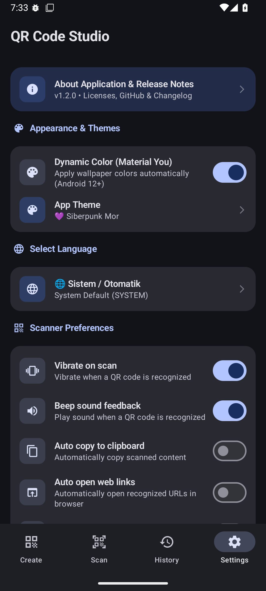

<div align="center">

<!-- LOGO -->


<h1>QR CODE STUDİO</h1>

<!-- BADGES -->
[](https://github.com/Dragons-Fox0058/qr-code-studio/releases/latest)
-
[-MIT-A31F34?style=for-the-badge&labelColor=A8A9AD)](https://github.com/Dragons-Fox0058/qr-code-studio?tab=MIT-1-ov-file)

<p>This is a QR code scanning application created using artificial intelligence (Google AI Studio).</p>

<!-- BADGES -->
[](https://android-arsenal.com/api?level=24)
[](https://kotlinlang.org)
[](https://developer.android.com/jetpack/compose)
[](https://m3.material.io)
[](https://opensource.org/licenses/MIT)

</div>

---

##  

- [Screenshots](#screenshots)
- [Features](#features)
- [Supported Languages](#supported-languages)
- [Technologies Used](#technologies-used)
- [Installation](#installation)
- [How to Build](#how-to-build)
- [Permissions](#permissions)
- [Contributing](#contributing)
- [Changelog](#changelog)
- [Licence](#licence)

---

##  

| Create | Scan | History | Settings |
|--------|------|---------|----------|
|  |  |  |  |

---

##  

- 50+ Language support
- Free QR code generation
- QR code scanning via camera and gallery
- Continuous scan mode
- Scan history with search
- Settings screen with full customization
- About screen with live GitHub release notes
- Smart update & notification system
- Multiple themes (Classic Blue, AMOLED Black, Ocean Blue, Emerald, Cyberpunk, Sunset, Rose)
- Material You dynamic color (Android 12+)
- Material 3 design language
- Audio feedback on scan (beep)
- Custom QR resolution (512px, 1024px, 2048px HD)
- Export format selection (PNG / JPEG)
- Cache & history management

---

##  

The application supports **20 languages**:

| # | Flag | Language | Code |
|---|------|----------|------|
| 1 | 🇹🇷 | Türkçe | `tr` |
| 2 | 🇬🇧 | English | `en` |
| 3 | 🇪🇸 | Español | `es` |
| 4 | 🇩🇪 | Deutsch | `de` |
| 5 | 🇫🇷 | Français | `fr` |
| 6 | 🇮🇹 | Italiano | `it` |
| 7 | 🇵🇹 | Português | `pt` |
| 8 | 🇷🇺 | Русский | `ru` |
| 9 | 🇨🇳 | 简体中文 | `zh` |
| 10 | 🇹🇼 | 繁體中文 | `zh-tw` |
| 11 | 🇯🇵 | 日本語 | `ja` |
| 12 | 🇰🇷 | 한국어 | `ko` |
| 13 | 🇸🇦 | العربية | `ar` |
| 14 | 🇮🇳 | हिन्दी | `hi` |
| 15 | 🇦🇿 | Azərbaycan | `az` |
| 16 | 🇳🇱 | Nederlands | `nl` |
| 17 | 🇵🇱 | Polski | `pl` |
| 18 | 🇺🇦 | Українська | `uk` |
| 19 | 🇮🇩 | Bahasa Indonesia | `id` |
| 20 | 🇻🇳 | Tiếng Việt | `vi` |
| 21 | 🇬🇷 | Ελληνικά | `el` |
| 22 | 🇮🇷 | فارسی | `fa` |
| 23 | 🇸🇪 | Svenska | `sv` |
| 24 | 🇳🇴 | Norsk | `no` |
| 25 | 🇩🇰 | Dansk | `da` |
| 26 | 🇫🇮 | Suomi | `fi` |
| 27 | 🇨🇿 | Čeština | `cs` |
| 28 | 🇭🇺 | Magyar | `hu` |
| 29 | 🇷🇴 | Română | `ro` |
| 30 | 🇧🇬 | Български | `bg` |
| 31 | 🇸🇰 | Slovenčina | `sk` |
| 32 | 🇷🇸 | Српски | `sr` |
| 33 | 🇭🇷 | Hrvatski | `hr` |
| 34 | 🇧🇦 | Bosanski | `bs` |
| 35 | 🇮🇱 | עברית | `he` |
| 36 | 🇹🇭 | ไทย | `th` |
| 37 | 🇲🇾 | Bahasa Melayu | `ms` |
| 38 | 🇧🇩 | বাংলা | `bn` |
| 39 | 🇵🇰 | اردو | `ur` |
| 40 | 🇵🇭 | Filipino | `tl` |
| 41 | 🇰🇪 | Kiswahili | `sw` |
| 42 | 🇰🇿 | Қазақша | `kk` |
| 43 | 🇺🇿 | Oʻzbekcha | `uz` |
| 44 | 🇬🇪 | ქართული | `ka` |
| 45 | 🇦🇲 | Հայերեն | `hy` |
| 46 | 🇱🇹 | Lietuvių | `lt` |
| 47 | 🇱🇻 | Latviešu | `lv` |
| 48 | 🇪🇪 | Eesti | `et` |
| 49 | 🇮🇸 | Íslenska | `is` |
| 50 | 🇦🇱 | Shqip | `sq` |

---

##  
| Technology | Explanation |
|-----------|-------------|
| [Kotlin Coroutines & Flow](https://kotlinlang.org/docs/coroutines-overview.html) | Asynchronous task management, background database operations, and reactive UI state streams |
| [AndroidX ViewModel & Lifecycle](https://developer.android.com/topic/libraries/architecture/viewmodel) | MVVM architecture and UI state persistence across screen rotations and lifecycle events |
| [AndroidX Activity Compose](https://developer.android.com/jetpack/androidx/releases/activity) | Hardware back-gesture management (`BackHandler`), edge-to-edge configuration, and activity contracts |
| [AndroidX Core KTX & WindowCompat](https://developer.android.com/jetpack/androidx/releases/core) | Status bar and navigation bar dynamic theming with `WindowInsetsControllerCompat` |
| [Android ToneGenerator API](https://developer.android.com/reference/android/media/ToneGenerator) | Low-latency audio feedback (beep sound) on successful QR recognition |
| [Android Vibrator & VibratorManager](https://developer.android.com/reference/android/os/VibratorManager) | Haptic vibration feedback on successful QR recognition |
| [Google Translate & Dictionary Engine](https://translate.google.com/) | Real-time multilingual text translation (online API with offline local dictionary fallback) |
| [Material You Dynamic Colors](https://m3.material.io/styles/color/dynamic-color/overview) | Android 12+ wallpaper-based dynamic color scheme generation (`dynamicColorScheme`) |
| [Android SharedPreferences](https://developer.android.com/training/data-storage/shared-preferences) | Persistent local storage for user settings, selected theme, language, and scanner preferences |
| [Android ClipboardManager](https://developer.android.com/reference/android/content/ClipboardManager) | Automatic and manual clipboard copy operations for scanned QR content |
| [Android MediaStore & Intent System](https://developer.android.com/training/data-storage/shared/media) | Gallery export (`MediaStore.Images`), custom in-app share sheet, and receiving shared text/images |
| [KSP (Kotlin Symbol Processing)](https://kotlinlang.org/docs/ksp-overview.html) | High-performance compile-time code generation for Room database |
| [OkHttp & Retrofit](https://square.github.io/) | Modern HTTP networking and REST API client infrastructure |
| [Moshi JSON](https://github.com/square/moshi) | Kotlin JSON serialization and deserialization library |

---

##  

### Requirements
- Android **7.0 (API 24)** or higher
- ~27 MB free storage

### Steps

1. Go to the [**Releases**](https://github.com/Dragons-Fox0058/qr-code-studio/releases/latest) page
2. Download the latest **`.apk`** file
3. On your Android device, open the downloaded file
4. If prompted, enable **"Install from unknown sources"** in your settings
5. Tap **Install** and open the app

> **Tip:** After installation, you can disable "Install from unknown sources" again for security.

---

##  

### Requirements
- [Android Studio](https://developer.android.com/studio) Hedgehog or newer
- JDK 17+
- Android SDK API 24+

### Steps

```bash
# 1. Clone the repository
git clone https://github.com/Dragons-Fox0058/qr-code-studio.git

# 2. Open the project in Android Studio
# File → Open → select the cloned folder

# 3. Let Gradle sync finish

# 4. Run on emulator or physical device
# Press the ▶ Run button or use:
./gradlew assembleDebug
```

> The generated APK will be at `app/build/outputs/apk/debug/app-debug.apk`

---

##  

The app is designed with **privacy in mind** and uses the minimum number of permissions possible.

### ✅ Runtime Permissions (User Approval Required)

| Permission | Reason | When Asked |
|---|---|---|
| `CAMERA` | To scan QR codes live via camera | Only when switching to the **Scan** tab |
| `POST_NOTIFICATIONS` | To notify when a new version is available (Android 13+) | On first launch |

### ⚙️ Normal Permissions (Granted Automatically at Install)

| Permission | Reason | When Asked |
|---|---|---|
| `VIBRATE` | Haptic feedback when a QR code is successfully scanned | Never — granted automatically |
| `INTERNET` | Fetch live release notes from GitHub API & translate scanned text | Never — granted automatically |
| `ACCESS_NETWORK_STATE` | Check connectivity before online translation or update checks | Never — granted automatically |

### ⭐ Permissions We Do NOT Request (Privacy Highlights)

| Permission | Why It's Not Needed |
|---|---|
| ❌ `READ_EXTERNAL_STORAGE` | Uses Android's modern **Photo Picker** — no broad gallery access needed |
| ❌ `ACCESS_FINE_LOCATION` | Wi-Fi QR creation/scanning is completely on-device without GPS |

> **Privacy note:** Internet permission is used exclusively to fetch release notes from GitHub and for on-demand text translation. No personal data, created QR codes, scan logs, or history are ever tracked, stored on cloud servers, or sent externally. All QR generation, scanning, and database history remain 100% private and on-device.
---

##  

Contributions are welcome! Here's how to get started:

1. **Fork** this repository
2. **Create** a new branch
```bash
git checkout -b feature/your-feature-name
```
3. **Make** your changes and commit
```bash
git commit -m "feat: add your feature description"
```
4. **Push** to your branch
```bash
git push origin feature/your-feature-name
```
5. **Open** a Pull Request on GitHub

### Guidelines
- Follow [Kotlin coding conventions](https://kotlinlang.org/docs/coding-conventions.html)
- Use Material 3 components for any UI changes
- Test on both light and dark mode before submitting

---

##  

###  — 

- **Settings Screen** — About moved from navigation bar into Settings; 4-tab navigation: Create, Scan, History, Settings
- **Live GitHub Release Notes** — Changelog fetched directly from GitHub Releases API with online/offline fallback and retry button
- **Multiple Themes** — Classic Blue, AMOLED Black, Ocean Blue, Emerald, Cyberpunk, Sunset, Rose
- **Material You Toggle** — Dynamic color (Android 12+) can now be enabled/disabled in Settings
- **Navigation Bar Color Sync** — System navigation bar and status bar color updates instantly with selected theme
- **Audio Feedback** — Optional beep sound on successful QR scan (ToneGenerator)
- **Continuous Scan Mode** — Camera stays open after scan for rapid scanning
- **QR Resolution Selector** — 512px, 1024px, 2048px (HD) quick selection chips
- **Export Format** — PNG and JPEG format preferences
- **Cache & Data Management** — Clear cache and clear history options in Settings
- **Localization Fixes** — All remaining hardcoded strings connected to LanguageManager
- **UI Cleanup** — Removed top bar language/dark mode toggles and redundant theme chips

### 

- **About Screen** — 4th tab with custom logo, version badge and release status
- **Smart Update & Notification System** — First-launch dialog, Android 13+ `POST_NOTIFICATIONS`, notification channel and manual update check
- **GitHub Repository Card** — One-tap link to open repository in browser
- **License & Transparency** — MIT License dialog and third-party licenses
- **Interactive Changelog** — In-app version history
- **Material You (Dynamic Color)** — Android 12+ (API 31+) wallpaper-based dynamic theming
- **Full Localization** — All screens translated in 20+ languages

### 

- QR code generation
- QR code scanning via camera and gallery
- Scan history with Room database
- Material 3 design
- Dark mode support
- 20 language support

---

## 💡 Why QR Code Studio?

Unlike generic QR scanning applications on Google Play that request full storage permissions and display intrusive advertisements, **QR Code Studio** is built from the ground up with a privacy-first mindset:

* **100% On-Device & Private:** Uses Android's modern **Photo Picker** API instead of broad media storage permissions (`READ_EXTERNAL_STORAGE`). Your photos and scan history never leave your device.
* **Ad-Free & Open Source:** Free to use, fully transparent, licensed under MIT, and completely free of tracking or ads.
* **Modern Android Stack:** Built with **Kotlin**, **Jetpack Compose**, **Material 3**, **Room Database**, and **ZXing**, served as a reference architecture created with **Google AI Studio**.
* **HD QR Generation:** Supports generating high-resolution QR codes up to 2048x2048 pixels.

---

## ❓ Frequently Asked Questions (FAQ)

### Is QR Code Studio safe and private?

Yes, absolutely. QR Code Studio operates entirely offline for all scanning and QR generation tasks.

It only requests camera permission for live scanning and uses Android Photo Picker for gallery images without accessing your full storage.

### Does QR Code Studio collect any user data?

No.

All your scan logs, custom QR codes, and application settings are stored locally on your device using an encrypted Room database.

### What technology stack does this project use?

This application is a 100% Kotlin project built using modern Android development practices:

* **UI:** Jetpack Compose & Material 3 (including Material You dynamic coloring)
* **Scanning Engine:** Google CameraX & ZXing
* **Database:** Android Jetpack Room
* **AI Co-Development:** Google AI Studio

### Can I use QR Code Studio as a reference for my Jetpack Compose projects?

Yes! The codebase is open-source under the MIT license.

It serves as an excellent reference for implementing CameraX live preview in Jetpack Compose, modern Photo Picker integration, and offline-first Room database architecture.


---

##  

This project is licensed under the **MIT License** — see the [](https://opensource.org/licenses/MIT) for details.
