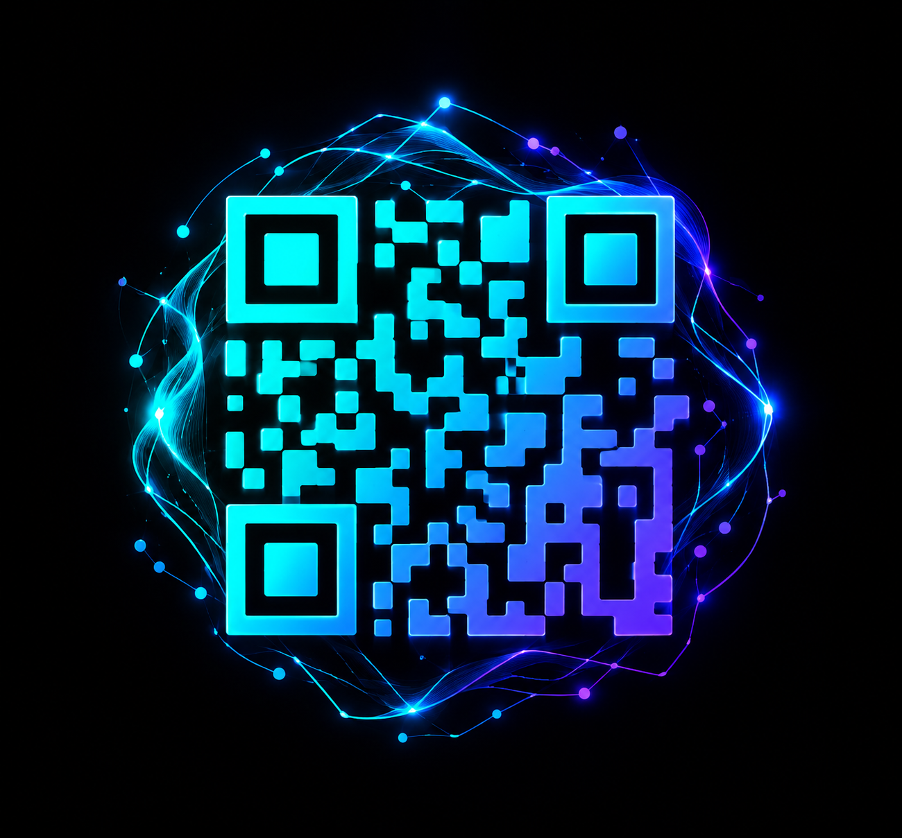
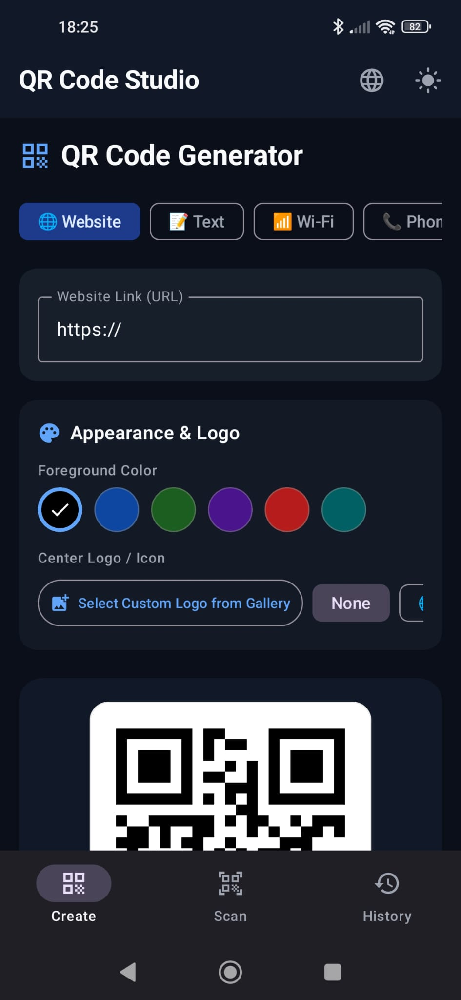
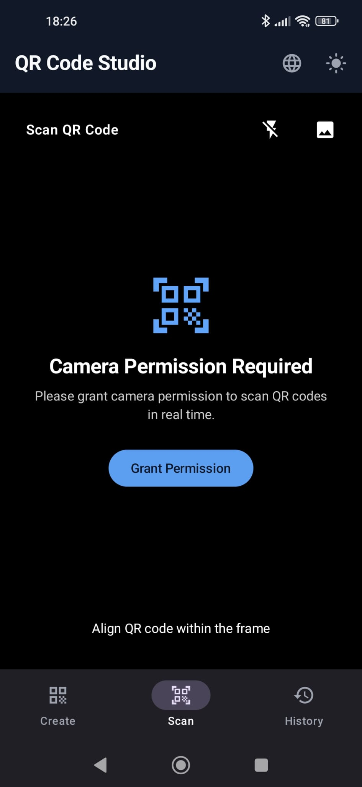
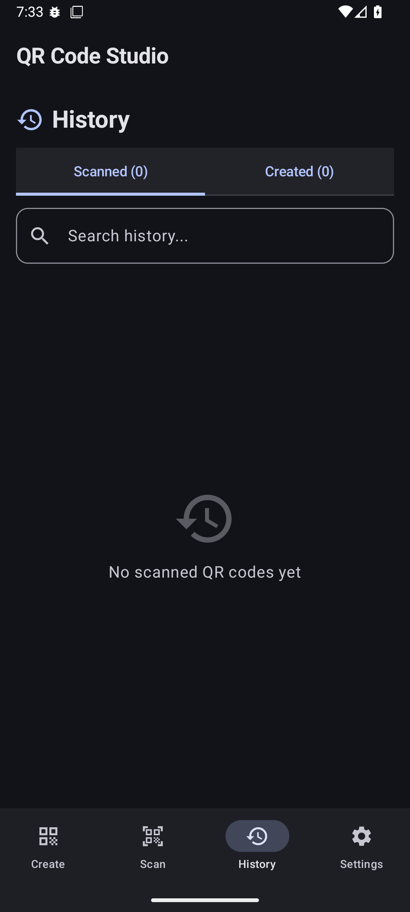

<div align="center">

<!-- LOGO -->


<h1>QR CODE STUDİO</h1>

<!-- BADGES -->
[](https://github.com/Dragons-Fox0058/qr-code-studio/releases/latest)
-
[-MIT-A31F34?style=for-the-badge&labelColor=A8A9AD)](https://github.com/Dragons-Fox0058/qr-code-studio?tab=MIT-1-ov-file)

<p>This is a QR code scanning application created using artificial intelligence (Google AI Studio).</p>

<!-- BADGES -->
[](https://android-arsenal.com/api?level=24)
[](https://kotlinlang.org)
[](https://developer.android.com/jetpack/compose)
[](https://m3.material.io)
[](https://opensource.org/licenses/MIT)

</div>

---

##  Table of Contents

- [Screenshots](#screenshots)
- [Features](#features)
- [Supported Languages](#supported-languages)
- [Technologies Used](#technologies-used)
- [Installation](#installation)
- [How to Build](#how-to-build)
- [Permissions](#permissions)
- [Contributing](#contributing)
- [Licence](#licence)

---

##  Screenshots

| Create | Scan | History |
|--------|------|---------|
|  |  |  |

---

##  Features

- 20 Language support
- Free QR code generation
- Scanning the QR code
- The ability to look back at the past
- Material 3 design language
- Dark mode support

---

##  Supported Languages

The application supports **20 languages**:

| # | Flag | Language | Code |
|---|------|----------|------|
| 1 | 🇹🇷 | Türkçe | `tr` |
| 2 | 🇬🇧 | English | `en` |
| 3 | 🇪🇸 | Español | `es` |
| 4 | 🇩🇪 | Deutsch | `de` |
| 5 | 🇫🇷 | Français | `fr` |
| 6 | 🇮🇹 | Italiano | `it` |
| 7 | 🇵🇹 | Português | `pt` |
| 8 | 🇷🇺 | Русский | `ru` |
| 9 | 🇨🇳 | 中文 | `zh` |
| 10 | 🇯🇵 | 日本語 | `ja` |
| 11 | 🇰🇷 | 한국어 | `ko` |
| 12 | 🇸🇦 | العربية | `ar` |
| 13 | 🇮🇳 | हिन्दी | `hi` |
| 14 | 🇦🇿 | Azərbaycanca | `az` |
| 15 | 🇳🇱 | Nederlands | `nl` |
| 16 | 🇵🇱 | Polski | `pl` |
| 17 | 🇺🇦 | Українська | `uk` |
| 18 | 🇮🇩 | Bahasa Indonesia | `id` |
| 19 | 🇻🇳 | Tiếng Việt | `vi` |
| 20 | 🇬🇷 | Ελληνικά | `el` |

---

##  Technologies Used

| Technology | Explanation |
|-----------|-------------|
| [Kotlin](https://kotlinlang.org/) | Main programming language |
| [Jetpack Compose](https://developer.android.com/jetpack/compose) | Modern user interface toolkit |
| [Material 3](https://m3.material.io/) | Design system |
| [AndroidX CameraX](https://developer.android.com/jetpack/androidx/releases/camera?hl=en) | Camera connection |
| [ZXing Core](https://zxing.github.io/zxing/) | Generating a QR code |
| [AndroidX Room](https://developer.android.com/jetpack/androidx/releases/room?hl=en) | For storage |
| [Android Photo Picker](https://developer.android.com/training/data-storage/shared/photo-picker?hl=en) | Photo selection |

---

##  Installation

### Requirements
- Android **7.0 (API 24)** or higher
- ~10 MB free storage

### Steps

1. Go to the [**Releases**](https://github.com/Dragons-Fox0058/qr-code-studio/releases/latest) page
2. Download the latest **`.apk`** file
3. On your Android device, open the downloaded file
4. If prompted, enable **"Install from unknown sources"** in your settings
5. Tap **Install** and open the app

> **Tip:** After installation, you can disable "Install from unknown sources" again for security.

---

##  How to Build

### Requirements
- [Android Studio](https://developer.android.com/studio) Hedgehog or newer
- JDK 17+
- Android SDK API 24+

### Steps

```bash
# 1. Clone the repository
git clone https://github.com/Dragons-Fox0058/qr-code-studio.git

# 2. Open the project in Android Studio
# File → Open → select the cloned folder

# 3. Let Gradle sync finish

# 4. Run on emulator or physical device
# Press the ▶ Run button or use:
./gradlew assembleDebug
```

> The generated APK will be at `app/build/outputs/apk/debug/app-debug.apk`

---

##  Permissions

The app is designed with **privacy in mind** and uses the minimum number of permissions possible.

### ✅ Runtime Permission (User Approval Required)

| Permission | Reason | When Asked |
|---|---|---|
| `CAMERA` | To scan QR codes live via camera | Only when switching to the **Scan** tab |

### ⚙️ Normal Permission (Granted Automatically at Install)

| Permission | Reason | When Asked |
|---|---|---|
| `VIBRATE` | Haptic feedback when a QR code is successfully scanned | Never — granted automatically |

### ⭐ Permissions We Do NOT Request (Privacy Highlights)

| Permission | Why It's Not Needed |
|---|---|
| ❌ `READ_EXTERNAL_STORAGE` | Uses Android's modern **Photo Picker** — no broad gallery access needed |
| ❌ `INTERNET` | Everything works **100% offline** — QR generation, scanning, and history are all on-device. No data is ever sent externally |

---

##  Contributing

Contributions are welcome! Here's how to get started:

1. **Fork** this repository
2. **Create** a new branch
```bash
   git checkout -b feature/your-feature-name
```
3. **Make** your changes and commit
```bash
   git commit -m "feat: add your feature description"
```
4. **Push** to your branch
```bash
   git push origin feature/your-feature-name
```
5. **Open** a Pull Request on GitHub

### Guidelines
- Follow [Kotlin coding conventions](https://kotlinlang.org/docs/coding-conventions.html)
- Use Material 3 components for any UI changes
- Test on both light and dark mode before submitting

---

##  Licence

This project is licensed under the **MIT License** — see the [](https://opensource.org/licenses/MIT) for details.
